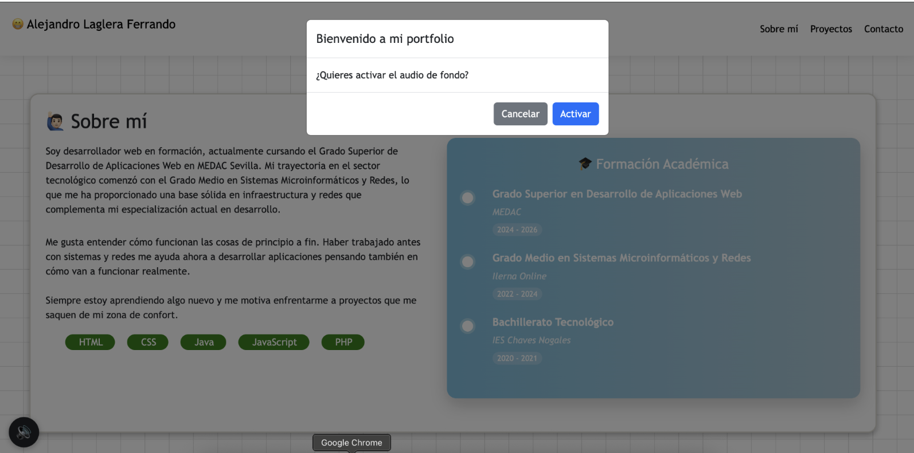
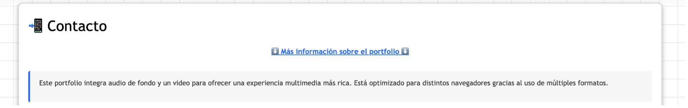
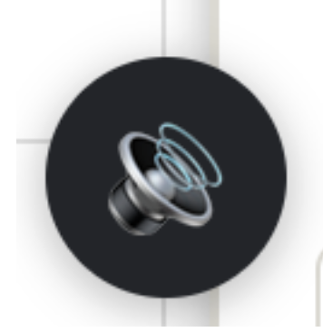

# MEDAC – Integración Multimedia  
**Ejercicio Temas 7-8**  
*Alejandro Laglera Ferrando*

---

## 📂 Índice
1. [Selección de formatos de audio y video](#1-selección-de-formatos-de-audio-y-video)
2. [Configuraciones de reproducción](#2-configuraciones-de-reproducción)
3. [Desafíos técnicos](#3-desafíos-técnicos)
4. [Capturas de pantalla](#4-capturas-de-pantalla)

---

## 1. Selección de formatos de audio y video

### 🎵 Audio de fondo
- **Formatos:**  
  `MP3 (192 kbps)` + `OGG (q7)`
- **Razón:**  
  - MP3 cubre el 98 % de navegadores.  
  - OGG asegura compatibilidad en Firefox/Chrome sobre Linux sin licencias.
- **Accesibilidad:**  
  - Botón **«Silenciar»** visible desde el primer momento.  
  - Modal de consentimiento al entrar para evitar molestias a usuarios con déficit de atención o lectores de pantalla.

### 🎬 Video de presentación
- **Formatos:**  
  `MP4 H.264 (baseline, 720p, 1 Mbps)` + `OGG Theora` + `WebM VP8`
- **Razón:**  
  - MP4 ⇨ Safari iOS / macOS.  
  - WebM ⇨ Chrome / Firefox / Edge.  
  - OGG ⇨ Navegadores open-source antiguos.
- **Accesibilidad:**  
  - Sin subtítulos (video mudo solo con música).  
  - Incluye `poster` para indicar contenido antes de pulsar.

---

## 2. Configuraciones de reproducción

| Elemento | Atributo | Valor | Justificación UX |
|----------|----------|--------|------------------|
| Audio | `preload` | `none` | No descarga hasta aceptar el modal → ahorro de datos móviles |
| Audio | `loop` + `volume` | `0.05` | Bucle suave sin distracción |
| Video | `preload` | `none` | No carga hasta clic → -800 kB en entrada |
| Video | `controls` | nativos | El usuario decide pausar o saltar |
| Video | `poster` | `img/poster.jpg` | Portada profesional antes de la reproducción |

---

## 3. Desafíos técnicos

| Problema | Solución implementada |
|----------|-----------------------|
| **Bloqueo de autoplay** | Modal que solicita activar el audio; tras aceptar, se reproduce. |
| **Volumen excesivo** | Volumen fijado a `0.05` al iniciar. |
| **Peso del video** | `preload="none"` + compresión en MP4, WebM y OGG. |
| **Botón flotante intrusivo** | Movido a la esquina inferior izquierda y reducido de tamaño. |
| **Compatibilidad Smart-TV / móviles viejos** | Códec H.264 baseline para máxima compatibilidad. |

---

## 4. Capturas de pantalla

| Descripción | Imagen |
|-------------|--------|
| **Modal de consentimiento** |  |
| **Sección Contacto (colapsable)** |  |
| **Video Portfolio** |  |
| **Botón flotante** |  |

---
